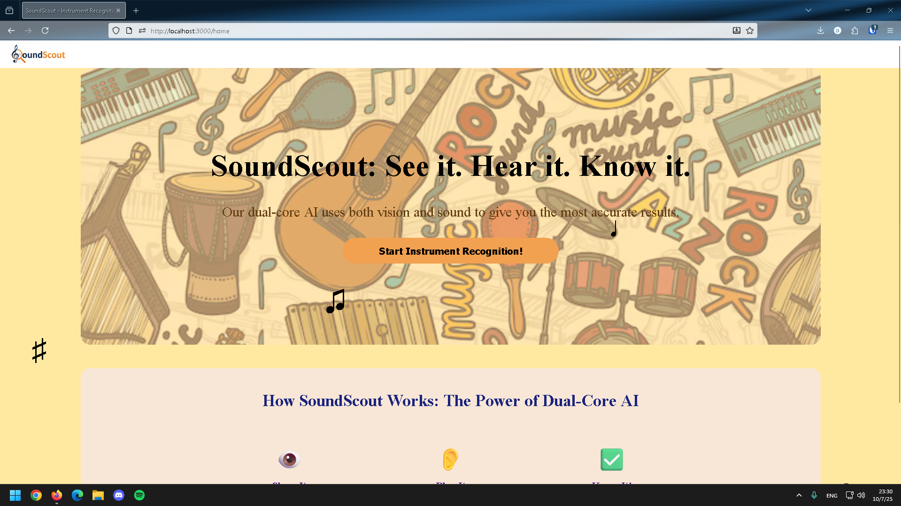

# SoundScout

**SoundScout** is an interactive platform that helps users discover and learn about musical instruments using AI-powered recognition. By analyzing images, videos, or audio clips, SoundScout identifies instruments and provides detailed insights into their history, cultural significance, and popular songs featuring them.

---

## Features

- **AI Instrument Recognition:** Identify instruments from images, videos, or audio clips.  
- **Educational Insights:** Learn about the instrument’s history, origins, and cultural impact.  
- **Media Integration:** Explore top songs and performances featuring the instrument.  
- **Interactive Experience:** Embedded media previews for a hands-on musical exploration.

---

## Contributors

- Donghae Yi  
- Abdirahman Ebiso  
- Nguyen Pham  

---

## Demo Video
<a href="[http://www.youtube.com/watch?feature=player_embedded&v=cdr9eSnpycM](https://youtu.be/HM08UwL2tco?si=Hoyj6PUG3hnnYw40)" target="_blank"></a>


---

## Technology Stack

- **Frontend:** HTML, CSS, JavaScript  
- **AI & Machine Learning:** ml5.js (MobileNet), Google Gemini API  
- **Backend:** Node.js, Express.js  
- **Templating:** Handlebars  
- **Additional Tools:** Spotify embeds, Webcam integration  

*(TBD: Add any other frameworks or libraries used)*

---

## How to Use

1. **Upload or capture** an image, video, or audio clip of a musical instrument.  
2. **Wait for AI recognition** to identify the instrument.  
3. **Explore detailed information** about the identified instrument, including history, cultural relevance, and top songs.  
4. **Interact with embedded media** to hear the instrument in action.  
5. **Try other instruments** to continue exploring and learning.

---

## Getting Started

1. Clone the repository:  
   ```bash
   git clone <repository-url>

2. Install dependencies:
    ```bash
    npm install

3. Add your Gemini API key to a .env file:
    ```bash
    GEMINI_API_KEY=YOUR_API_KEY_HERE

4. Start the development server:
    ```bash
    npm run dev

5.Open your browser and navigate to http://localhost:3000 to begin exploring.

---
